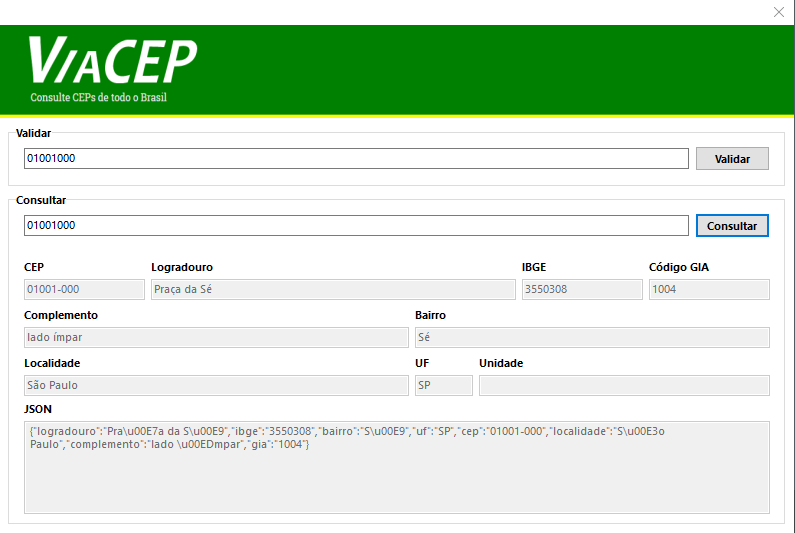

# ViaCEP - Consulte CEP de todo o Brasil


## Pré-requisitos
 * `[Opcional]` Para facilitar o gerenciamento de dependências, eu recomendo utilizar o Boss.
   * [**Boss**](https://github.com/HashLoad/boss) - Gerenciador de dependências para Delphi
 * Possuir as dlls **libeay32.dll** e **ssleay32.dll** na pasta do projeto junto ao executável.
 
## Instalação utilizando o Boss
```
boss install github.com/viniciussanchez/viacep
```

## Instalação manual
Adicione a seguinte pasta no seu projeto em *Project > Options > Resource Compiler > Directories and Conditionals > Include file search path*
```
../viacep/src
```

## Começando
Você vai precisar fazer o uses das seguintes units: `ViaCEP.Intf`, `ViaCEP.Core`, `ViaCEP.Model`
```pascal
uses ViaCEP.Intf, ViaCEP.Core, ViaCEP.Model;
```

### Validando um CEP
Quando consultado um CEP de formato inválido, por exemplo: `950100100` (9 dígitos), `95010A10` (alfanumérico), `95 01010` (espaço), o retorno será `nil`. 

O método de validar se é um CEP válido ou não, apenas certifica-se de que o CEP informado possui `8` dígitos e que todos sejam numéricos, podendo ser acessado antes de consultar o webservice por meio da interface `IViaCEP`, utilizando o método `Validate`.

Quando consultado um CEP de formato válido, porém inexistente, por exemplo: `99999999`, o retorno também será `nil`. Isso significa que o CEP consultado não foi encontrado na base de dados.

Exemplo:
```pascal
var
  ViaCEP: IViaCEP;
begin
  ViaCEP := TViaCEP.Create;
  if ViaCEP.Validate('01001000') then
    ShowMessage('CEP válido')
  else
    ShowMessage('CEP inválido');
end;
```

Vale lembrar que no método acima, não é necessário destruir a instância criada da classe `TViaCEP`, pelo fato de estar utilizando uma `Interface`.

### Consultando um CEP
```pascal
var
  ViaCEP: IViaCEP;
  CEP: TViaCEPClass;
begin
  ViaCEP := TViaCEP.Create;
  // Aqui você pode chamar a rotina para validar se é um CEP válido.
  CEP := ViaCEP.Get(edtCEPConsultar.Text);
  if not Assigned(CEP) then
    Exit; // Aqui você pode exibir uma mensagem para o usuário falando que o CEP não foi encontrado.
  try
    edtJSON.Lines.Text := CEP.ToJSONString;
    edtCEP.Text := CEP.CEP;
    edtLogradouro.Text := CEP.Logradouro;
    edtComplemento.Text := CEP.Complemento;
    edtBairro.Text := CEP.Bairro;
    edtLocalidade.Text := CEP.Localidade;
    edtUF.Text := CEP.UF;
    edtUnidade.Text := CEP.Unidade;
    edtIBGE.Text := CEP.IBGE;
    edtGIA.Text := CEP.GIA;
  finally
    CEP.Free;
  end;
end;
```

### Retorno da consulta no formato JSON
Após realizar a consulta do CEP, você pode pegar o conteúdo retornado no formato JSON utilizando a método **.ToJSONString** disponível na classe `TViaCEPClass`. Veja o exemplo abaixo, onde é populado um `TMemo` com o conteúdo da consulta:
```pascal
var
  CEP: TViaCEPClass;
begin
  Memo.Lines.Text := CEP.ToJSONString;
end;
```  
```
{
  "cep": "01001-000",
  "logradouro": "Praça da Sé",
  "complemento": "lado ímpar",
  "bairro": "Sé",
  "localidade": "São Paulo",
  "uf": "SP",
  "unidade": "",
  "ibge": "3550308",
  "gia": "1004"
}
```

## Achou um CEP desatualizado?
Acesse o formulário e atualize on-line: [**Atualizar CEP**](https://viacep.com.br/cep/) 

## Links úteis
Origem código IBGE dos municípios: [**Acessar Site**](https://cidades.ibge.gov.br/) 

Origem código GIA/ICMS (apenas SP disponível): [**Visualizar PDF (Pág.137)**](https://portal.fazenda.sp.gov.br/servicos/gia/Downloads/pre_formatado_ngia_v0210_gia0801.pdf)

ViaCEP - Webservice CEP e IBGE gratuito: [**Acessar Site**](https://viacep.com.br/) 

 
